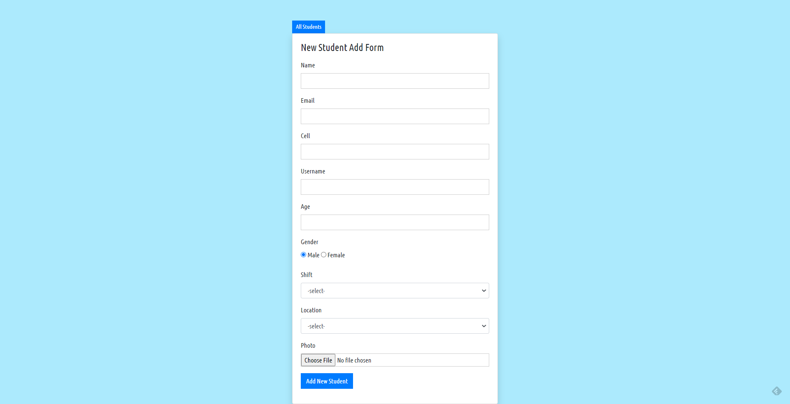
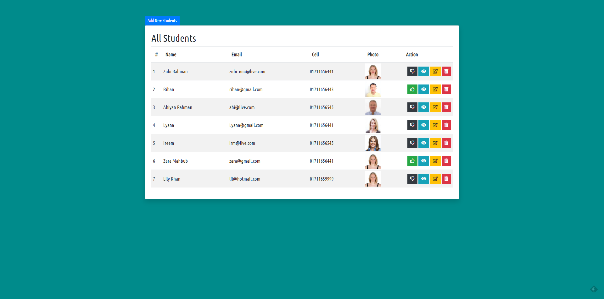
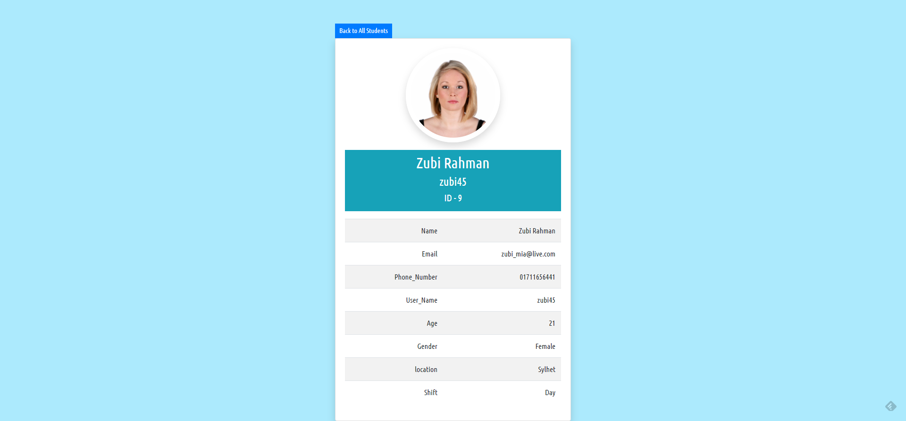
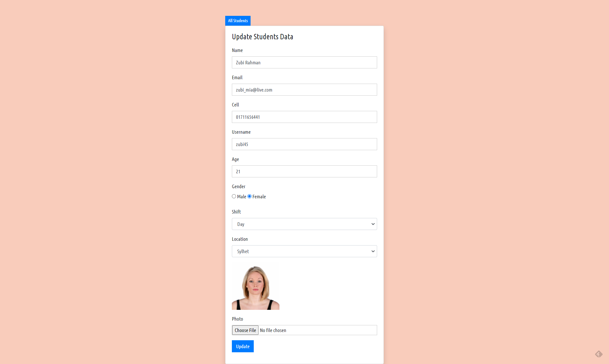

### CRUD Application - Student Database with PHP
#### Features:
- Form to send Students data to database (index.php)  
- Show student data on a table (students.php)
- table with active/inactive button, show show(link with profile.php), delete button, and Edit button (link with Edit.php)
- Show single student data in separate page (profile.php) 

-------
#### Index.php (The form page).
* Only form
        * form with POST Method and file/photo receive ready.
    * Receive data with POST function.
    * Check empty cells and send validation notificaiton
    * create database and create connection with it
    * Send data to database
    * give success message.
-------
#### edit.php page (steps)
 * Copy index.php to create a new form
 * set page link at Edit button (on students.php page), also send student id via url
 * get the student id by GET function
 * Run query to get the data of that student (SELECT * FROM student WHERE id =)
 * Run fetch_assoc() function to unpack(😁) the data  

-----
#### Status active and inactive 
* send user_id on the url (sent from both active and inactive button)
* Receive the data from url with get function
* Run Update query to databae with $active_id 
* and Run Update query to databae with $inactive_id (copy and change).

 *Note:* 
 - its taking time to change from active to inactive (vise varsa).
 - There is no effect on the view button despite change in status

 Final output:

**The New Student Form page**

 

**All Student Database View Page**

 

**Profile Page**

 

**Profile update form Page**

 [Follow me on twitter](https://twitter.com/freedombyte)
        
 
